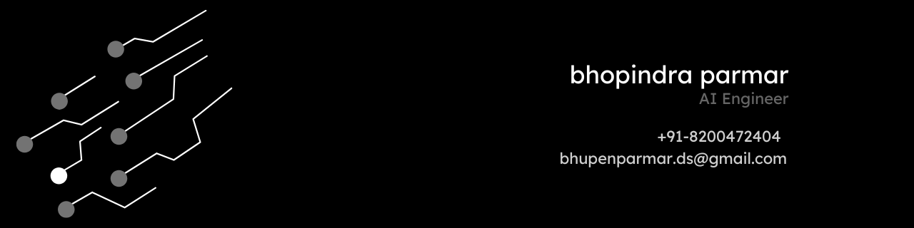
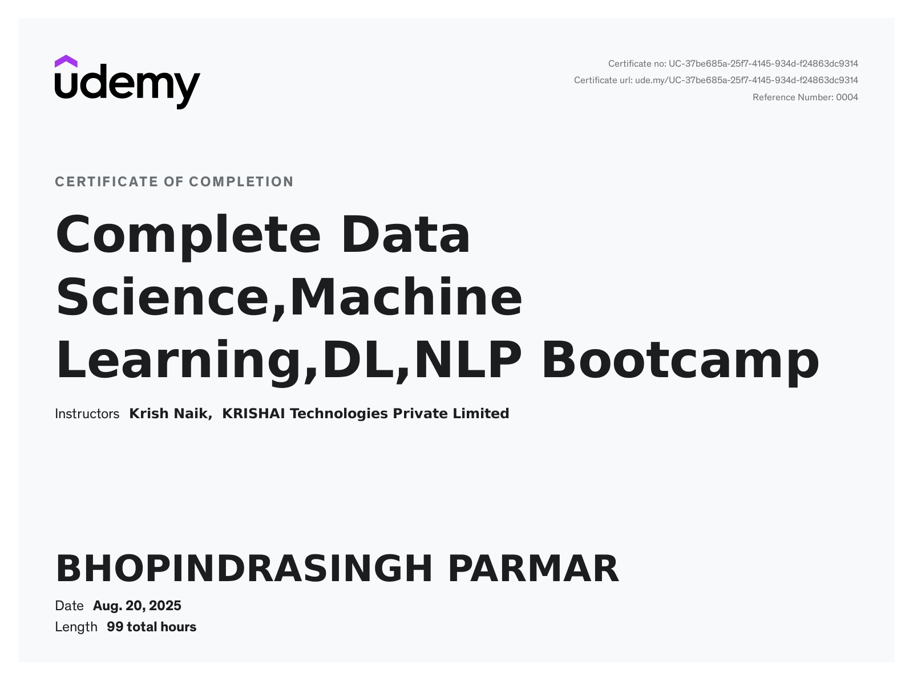
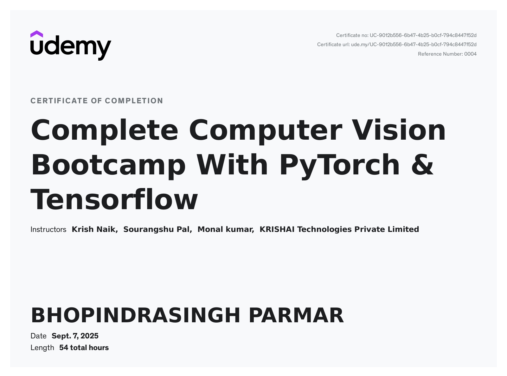
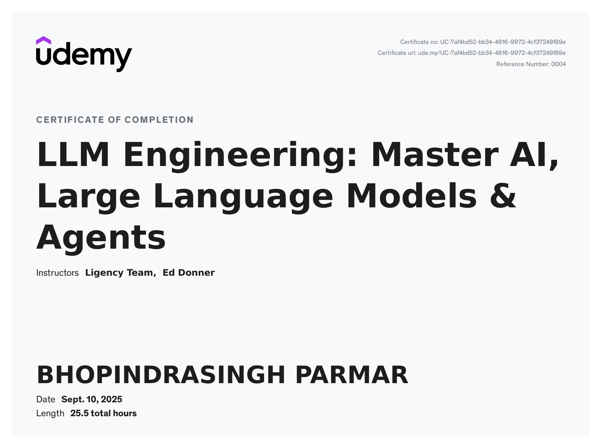

<!-- Top Capsule Render Banner -->

<!-- Your custom banner -->

  

<h1 align="center">Bhopindra Parmar</h1>

  

  <h2>🌐 Connect with Me</h2>
  
Discover my work and connect on these platforms!

| LinkedIn | GitHub | Email | Leetcode |
| --- | --- | --- | --- | 
| |  |  | 

<h2 align="center">🚀 About Me</h2>
I’m Bhopindra Parmar from India, a Computer Engineering graduate who believes engineering is more than writing code it’s about turning simple ideas into something meaningful. What began as experimenting with small programs slowly grew into a passion for building things that work, last, and actually help people. For me, the joy is in shaping raw thoughts into products that feel alive. Outside of tech, I follow football and hip-hop, both of which keep me grounded in creativity and rhythm.

<h2 align="center">🎓 AI &amp; ML Practitioner Certifications</h2>

  <table style="width:100%; table-layout:fixed;">
    <tr>
      <!-- Certificate Image Row -->
      <td align="center" width="25%">
        
      </td>
      <td align="center" width="25%">
        
      </td>
      <td align="center" width="25%">
        
      </td>
      <td align="center" width="25%">
        
      </td>
    </tr>
    <tr>
      <!-- Certificate Text Row -->
      <td align="center">Complete Data Science,Machine Learning,DL,NLP Bootcamp</td>
      <td align="center">Complete Computer Vision Bootcamp With PyTorch & Tensorflow</td>
      <td align="center">LLM Engineering: Master AI, Large Language Models & Agents</td>
      <td align="center">RAG Engineering</td>
    </tr>
  </table>

  

<table>
  <tr>
    <td>
      
    </td>
    <td>
      
    </td>
    <td>
      
    </td>
  </tr>
</table>

### Top Repositories

  <table>
    <tr>
      <td>
        
      </td>
      <td>
        
      </td>
    </tr>
    <tr>
      <td>
        
      </td>
      <td>
        
      </td>
    </tr>
    <tr>
      <td>
        
      </td>
      <td>
        
      </td>
    </tr>
  </table>

### GitHub Contribution Chart

<h1 align="center"> Tech Stack</h1>

<h3 align="center">Core AI/ML</h3>

  <table style="background-color: black; color: white; border: none; border-radius: 15px; overflow: hidden;">
  <thead>
    <tr>
      <th colspan="5" align="center" style="color: white;">Languages & Libraries</th>
    </tr>
  </thead>
  <tbody>
    <tr>
      <td align="center" style="border: none;">
         Python
      </td>
      <td align="center" style="border: none;">
        
    OpenCV
      </td>
      <td align="center" style="border: none;">
         TensorFlow
      </td>
      <td align="center" style="border: none;">
         PyTorch
      </td>
    </tr>
  </tbody>
 </table>

  <table style="background-color: black; color: white; border: none; border-radius: 15px; overflow: hidden;">
    <thead>
      <tr>
        <th colspan="4" align="center" style="color: white;">Frameworks & Tools</th>
      </tr>
    </thead>
    <tbody>
      <tr>
        <td align="center" style="border: none;">
           LangChain
        </td>
        <td align="center" style="border: none;">
          <picture>
            <source media="(prefers-color-scheme: dark)" srcset="https://unpkg.com/@lobehub/icons-static-png@latest/dark/langgraph.png" />
            
          </picture> LangGraph
        </td>
        <td align="center" style="border: none;">
         <picture>
            <source media="(prefers-color-scheme: dark)" srcset="https://unpkg.com/@lobehub/icons-static-png@latest/dark/ollama.png" />
            
          </picture> Ollama
        </td>
        <td align="center" style="border: none;">
           LlamaIndex
        </td>
      </tr>
    </tbody>
  </table>

<h3 align="center">☁️ DevOps & Cloud</h3>

<table style="background-color: black; color: white; border: none; border-radius: 15px; overflow: hidden;">
  <thead>
    <tr>
      <th colspan="4" align="center" style="color: white;">Backend & Database</th>
    </tr>
  </thead>
  <tbody>
    <tr>
      <td align="center" style="border: none;">
        
 FastAPI
      </td>
      <td align="center" style="border: none;">
        
 Flask
      </td>
      <td align="center" style="border: none;">
         MySQL
      </td>
      <td align="center" style="border: none;">
         MongoDB
      </td>
    </tr>
  </tbody>
</table>

<table style="background-color: black; color: white; border: none; border-radius: 15px; overflow: hidden;">
  <thead>
    <tr>
      <th colspan="4" align="center" style="color: white;">Cloud Platforms</th>
    </tr>
  </thead>
  <tbody>
    <tr>
      <td align="center" style="border: none; padding: 12px;">
           AWS
        </td>
      <td align="center" style="border: none; padding: 12px;">
           Azure
        </td>
      <td align="center" style="border: none;">
         GCP
      </td>
    </tr>
  </tbody>
</table>

<table style="background-color: black; color: white; border: none; border-radius: 15px; overflow: hidden;">
  <thead>
    <tr>
      <th colspan="4" align="center" style="color: white;">Containers & Orchestration</th>
    </tr>
  </thead>
  <tbody>
    <tr>
      <td align="center" style="border: none;">
         Docker
      </td>
      <td align="center" style="border: none;">
 Kubernetes
      </td>
    </tr>
  </tbody>
</table>

<table style="background-color: black; color: white; border: none; border-radius: 15px; overflow: hidden;">
  <thead>
    <tr>
      <th colspan="6" align="center" style="color: white;">CI/CD & Automation</th>
    </tr>
  </thead>
  <tbody>
    <tr>
      <td align="center" style="border: none;">
         Git
      </td>
      <td align="center" style="border: none;">
         Jenkins
      </td>
      <td align="center" style="border: none;">
         GitHub Actions
      </td>
      <td align="center" style="border: none;">
         GitLab CI/CD
      </td>
      <td align="center" style="border: none;">
         ArgoCD
      </td>
      <td align="center" style="border: none;">
         CircleCI
      </td>
    </tr>
  </tbody>
</table>

<table style="background-color: black; color: white; border: none; border-radius: 15px; overflow: hidden;">
  <thead>
    <tr>
      <th colspan="4" align="center" style="color: white;">Monitoring & Logging</th>
    </tr>
  </thead>
  <tbody>
    <tr>
      <td align="center" style="border: none;">
        
 Grafana
      </td>
      <td align="center" style="border: none;">

 Prometheus
      </td>
      <td align="center" style="border: none;">

 ELK Stack (Elasticsearch • Logstash • Kibana)
      </td>
    </tr>
  </tbody>
</table>

<table style="background-color: black; color: white; border: none; border-radius: 15px; overflow: hidden;">
  <thead>
    <tr>
      <th colspan="4" align="center" style="color: white;">OS & Essentials</th>
    </tr>
  </thead>
  <tbody>
    <tr>
      <td align="center" style="border: none;">
         Git
      </td>
      <td align="center" style="border: none;">
 Linux
      </td>
    </tr>
  </tbody>
</table>

<h2 align="center">📫 Let's Connect!</h2>
<table align="center">
  <thead>
    <tr>
      <th>Email</th>
    </tr>
  </thead>
  <tbody>
    <tr>
      <td align="center">
        <a href="mailto:bhupenparmar.ds@gmail.com" target="_blank">
          
           
          bhupenparmar.ds@gmail.com
        </a>
      </td>
      </tr>
  </tbody>
</table>
 
<h3>

  
⭐️ From [Bhopindra Parmar](https://github.com/bhupencoD3) | Because every idea deserves a chance to become real.!
 

</h3>

